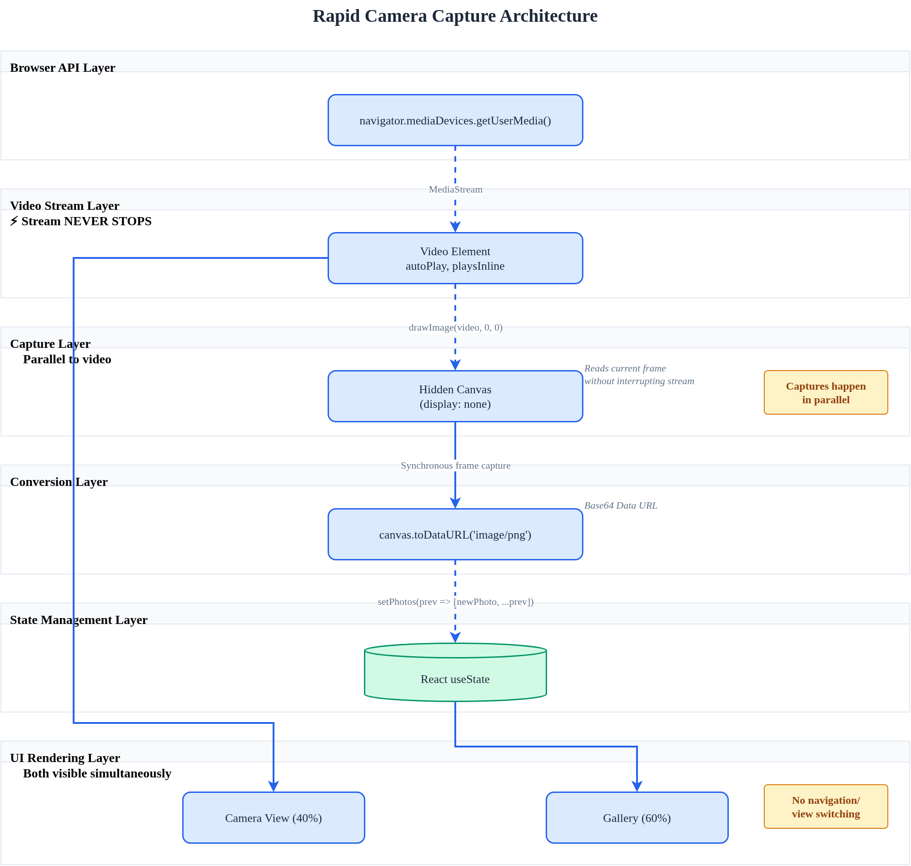

# Rapid Camera Capture Architecture

## The Core Problem

Most camera apps switch between camera view and preview/gallery, breaking the flow. You take a photo, it shows you the photo, you have to navigate back to the camera. Can't rapid-fire multiple shots without the UI getting in the way.

## The Solution

Keep the camera stream running continuously while rendering captured photos alongside it. No navigation, no mode switching.



## How It Works

### 1. Persistent Video Stream

```typescript
// Initialize once, never stop
const mediaStream = await navigator.mediaDevices.getUserMedia({
  video: { facingMode: 'user' },
  audio: false
})
videoRef.current.srcObject = mediaStream
```

The `<video>` element keeps streaming. Nothing interrupts it when you capture.

### 2. Frame Capture via Hidden Canvas

```typescript
const capturePhoto = () => {
  const canvas = canvasRef.current
  const context = canvas.getContext('2d')

  canvas.width = video.videoWidth
  canvas.height = video.videoHeight
  context.drawImage(video, 0, 0)

  const dataUrl = canvas.toDataURL('image/png')
  // Store dataUrl in state
}
```

Key: Canvas is `display: none`. You're reading the current video frame without affecting the DOM or stream.

### 3. React State for Gallery

```typescript
const [photos, setPhotos] = useState<Photo[]>([])
setPhotos(prev => [newPhoto, ...prev])
```

Each capture prepends to the array. React re-renders the gallery, video keeps running.

### 4. Split Layout

```css
.main-content {
  display: grid;
  grid-template-columns: 40% 60%;
}
```

Camera on left (40%), gallery on right (60%). Both visible simultaneously. No view switching.

## Recreation Steps

1. **Set up video stream**
   - Use `getUserMedia()` to get MediaStream
   - Assign to `<video>` ref's `srcObject`
   - Set `autoPlay` and `playsInline` attributes

2. **Create hidden canvas**
   - Canvas with `display: none`
   - Store ref to it
   - Use canvas 2d context to draw video frames

3. **Capture handler**
   - `drawImage(video, 0, 0)` copies current frame
   - `toDataURL()` converts to base64 string
   - Store result in React state array

4. **Render split UI**
   - Video element on one side
   - Map photos array to image elements on other side
   - Both in same DOM, no conditional rendering

5. **Critical: No navigation or modals**
   - Everything happens in place
   - No state that switches between "camera" and "gallery" views
   - No full-screen previews that hide the camera

## Why This Works

- **MediaStream never stops**: Calling `toDataURL()` doesn't interrupt the stream
- **Canvas is synchronous**: No async wait between frames
- **State updates don't unmount video**: React reconciliation keeps the video element mounted
- **Grid layout**: Both views exist simultaneously in the DOM

That's it. Camera stays live, captures are instant, gallery updates in real-time.
